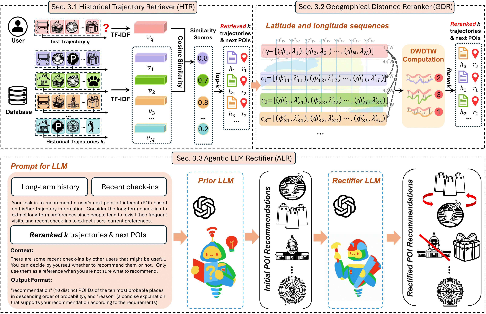

# [PRICAI' 2025] RALLM-POI: Retrieval-Augmented LLM for Zero-shot Next POI Recommendation with Geographical Reranking

This repository contains the implementation of **RALLM-POI**, a novel approach for zero-shot next Point-of-Interest (POI) recommendation that combines Retrieval-Augmented Generation (RAG) with Large Language Models (LLMs) and geographical reranking.

## 🎯 Abstract
Next point-of-interest (POI) recommendation predicts a user’s next destination from historical movements. Traditional models require intensive training, while LLMs offer flexible and generalizable zero-shot solutions but often generate generic or geographically irrelevant results due to missing trajectory and spatial context. To address these issues, we propose RALLM-POI, a framework that couples LLMs with retrieval-augmented generation and self-rectification. We first propose a Historical Trajectory Retriever (HTR) that retrieves relevant past trajectories to serve as contextual references, which are then reranked by a Geographical Distance Reranker (GDR) for prioritizing spatially relevant trajectories. Lastly, an Agentic LLM Rectifier (ALR) is designed to refine outputs through self-reflection. Without additional training, RALLM-POI achieves substantial accuracy gains across three real-world Foursquare datasets, outperforming both conventional and LLM-based baselines.



*Figure 1: Overview of the RALLM-POI framework.*

## 🚀 Installation

### Prerequisites

- Python 3.8+
- CUDA-compatible GPU (recommended)
- OpenAI API key

### Dependencies

Install the required packages:

```bash
pip install torch torchvision torchaudio
pip install transformers
pip install scikit-learn
pip install openai
pip install pandas numpy
pip install tqdm
pip install rank-bm25
pip install matplotlib
```

### Setup

1. Clone the repository:
```bash
git clone https://github.com/LKRcrocodile/RALLM-POI.git
cd RALLM-POI
```

2. Set up your OpenAI API key:
```bash
export OPENAI_API_KEY="your_openai_api_key_here"
```

## 📊 Dataset

The repository includes preprocessed data for three cities:

- **NYC**: New York City POI data
- **PHO**: Phoenix POI data  
- **SIN**: Singapore POI data

### Data Structure

- `raw_data/`: Original POI information and mapping files
- `processed_data/`: Preprocessed trajectory data split into train/validation/test sets
- `experiments_rag/`: Short-term history and recommendation data for RAG

## 🔧 Usage


Run the main experiment with default settings:

```bash
python main_rallm_poi.py --city PHO
```

You can also change city to PHO/SIN/NYC

## 📝 Citation

If you use this code in your research, please cite our paper:

```bibtex
@inproceedings{li2025rallmpoi,
  title={RALLM-POI: Retrieval-Augmented LLM for Zero-shot Next POI Recommendation with Geographical Reranking},
  author={Li, Kunrong and Lim, Kwan Hui},
  booktitle={Pacific Rim International Conference on Artificial Intelligence},
  year={2025}
}
```

## 📄 License

This project is licensed under the MIT License - see the LICENSE file for details.

---

**Note**: Make sure to set up your OpenAI API key before running experiments. The system will prompt you for the key if not found in environment variables.